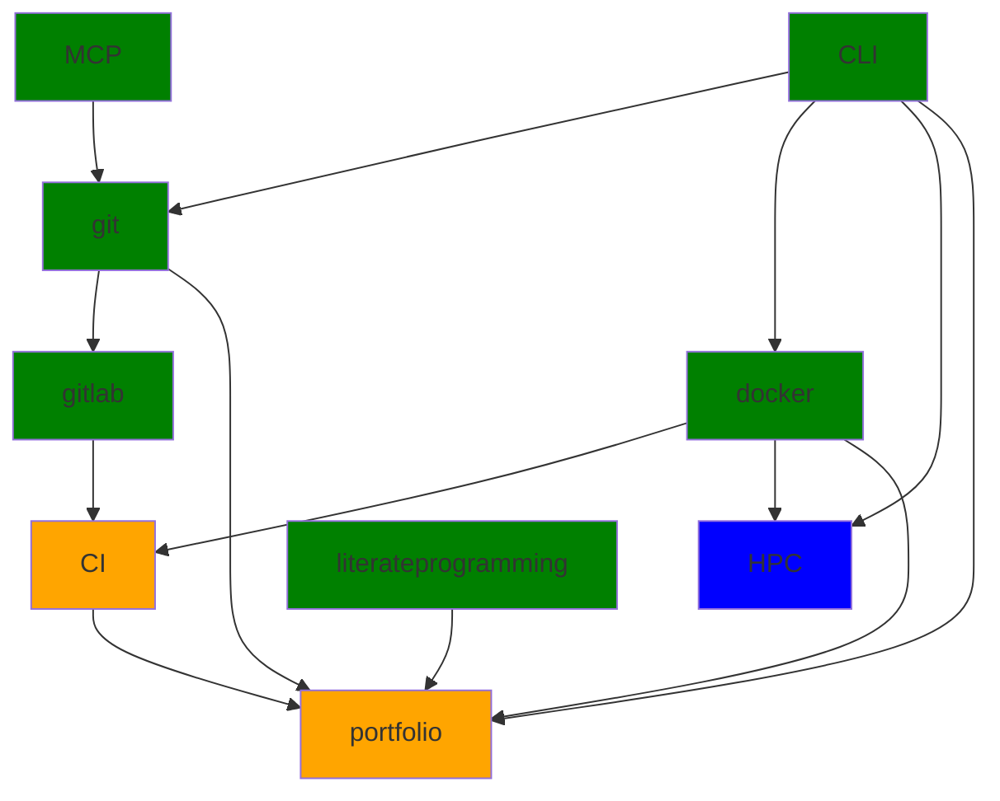

# Research Data Management

This repository contains the course materials for the course "Research Data
Managment and Social Responsability" for the winter term 2025/26. To download the data clone the
repository.

Table of Contents

[[_TOC_]]

## Roadmap

## Classes

### Week 1

<2025-10-13 Mon 09:15-11:30>

#### Self-study

- Log into Gitlab (https://git.sc.uni-leipzig.de)
- Do the assignments on Gitlab [here](https://git.sc.uni-leipzig.de/groups/ws2025rdm/-/epics?state=opened&page=1&sort=start_date_desc&label_name[]=homework).

#### In class

- Introduction
- Portfolio/Grading
- Flipped classroom
- Introduction to Gitlab
- Getting everyone up to speed with installing software

---

### Week 2

<2025-10-20 Mon 09:15-11:30>

#### Self-study

- Get you LLM cli running
- See the presentation on Linux

#### In class

- Go over Gitlab interface
- Materials Repo
- Portfolio Repo
- Data basics lecture
- Linux CLI
    - make sure everyone has an ssh key

---

### Week 3

<2025-10-27 Mon 09:15-11:30>

#### Self-study

- finish setting up your SSH client
  - Configuration `.ssh/config`
  - Keyring for ssh key
- Make sure everyone has an LLM client

#### In class

- Questions regarding portfolio
- [Secure passwords](https://xkcd.com/936/), [explanation](https://www.explainxkcd.com/wiki/index.php/936:_Password_Strength)
- Primer on LLMs
- Set up git course, see [here](https://github.com/gdkrmr/mcp-git-course).

---

### Week 4

<2025-11-03 Mon 09:15-11:30>

#### Self-study

- Learn git through the chat interface

#### In class

- Software versioning
- Git

---

### Week 5

<2025-11-10 Mon 09:15-11:30>

#### Self-study

- Learn git through the chat interface

#### In class

- [Dates for Portfolio](#portfolio)
- Gitlab
  - Deleting repos
  - Visibility/namespaces
  - Walk through guestbook submissions
- Show the structure of git with `git cat-file -p <hash>`
- Data Management Plans

---

### Week 6

<2025-11-17 Mon 09:15-11:30>

#### Self-study

- give feedback on learning git with LLMs
- pull updated portfolio (after I update it with an example, -> DONE)
- Install `quarto`, see [here](https://quarto.org/docs/get-started/)

#### In class

- Finish lecture on licensing
- Check course overview
- Give some time to answer survey on git/LLMs if necessary
- Literate programming
- Makefiles
- Compile your portfolio/the example project/the materials repository

---

### Week 7

<2025-11-24 Mon 09:15-11:30>

#### Self-study

- Check out docker, see presentation
  - Install docker
  - run `docker run hello-world`
- I have updated the slides with some markdown syntax. Also look at the quarto documentation for more specific syntax
- Get the portfolio compiled on your local machine

#### In class

- Containerization/Docker

---

### Week 8

<2025-12-01 Mon 09:15-11:30>

#### Self-study

- Finish what you started in class

#### In class

- package managers vs. containers vs. virtualization
- containers
  - separate build environment from data
- Reproducible research

---

### Week 9

<2025-12-08 Mon 09:15-11:30>

---

### Week 10

<2025-12-15 Mon 09:15-11:30>

---

### Week 11

<2026-01-05 Mon 09:15-11:30>

#### In class

- Talk about git course feedback.

---

### Week 12

<2026-01-12 Mon 09:15-11:30>

---

### Week 13

<2026-01-19 Mon 09:15-11:30>

---

### Week 14

<2026-01-26 Mon 09:15-11:30>

---

### Week 15

<2026-02-02 Mon 09:15-11:30>

## Portfolio

Dates are not official yet:

- Portfolio: 2026-02-06
- Repeat test: 2026-03-27
